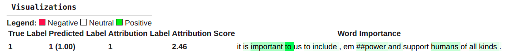
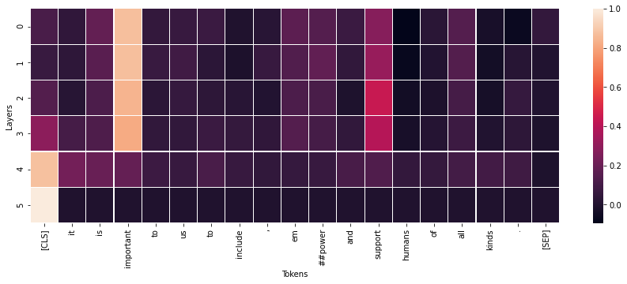
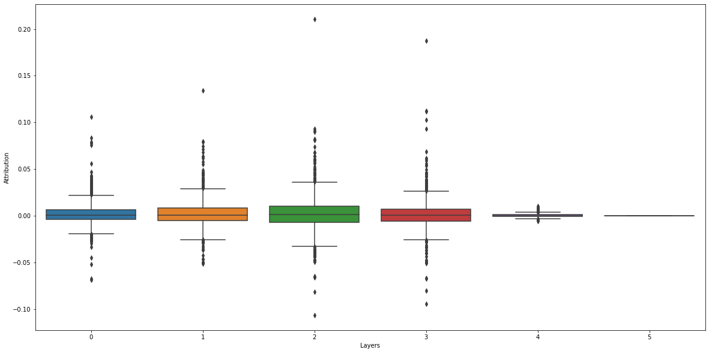
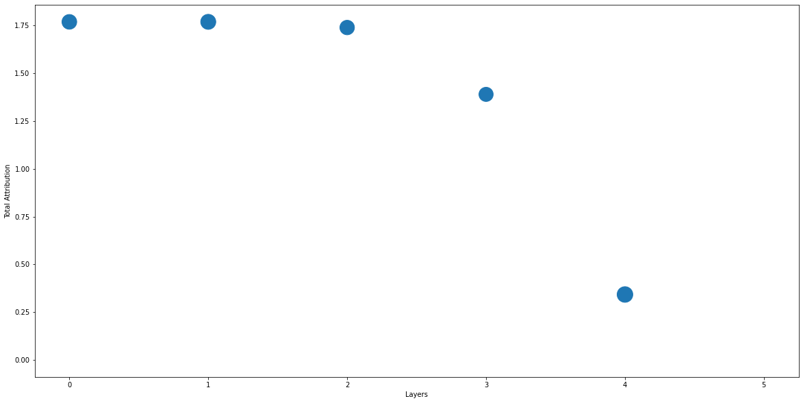
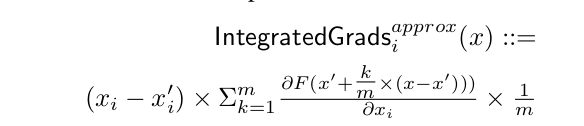
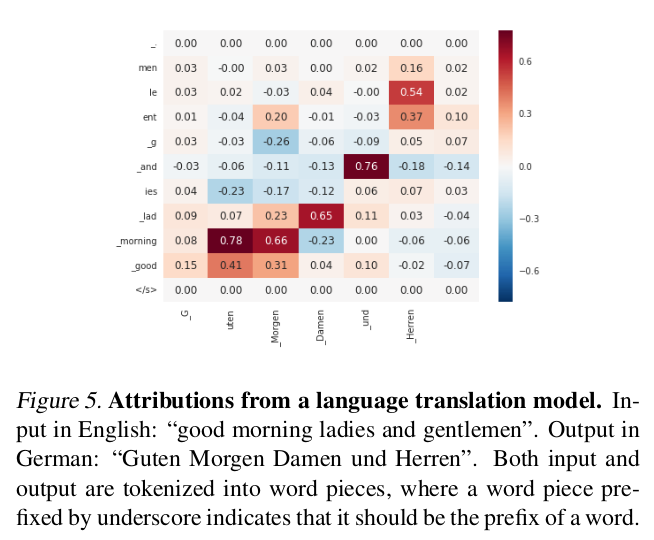

# 100daysofNLP
From last month i was involve in few personal things and didn't get much time to explore NLP. I wanna be on trek. I want to learn and explore things in NLP consistently. 

So i am taking challenge to learn NLP for 100days to get back to the awesome world of NLP.

During this 100days the goal is to,
* Learn NLP stuff, 
* Contribute to opensource, 
* Read Research paper,  
* Write blog in NLP,
* Build Something New and Opensource it.

The most important thing share it on twitter and Linkedin. Maintain it on this github repository.

## Day1:

Started Learning about Model Interpretability in Pytorch Model using [Captum](https://github.com/pytorch/captum). In NLP we build models with great performance but It's important to know how the model is predicting. What kind of text is focused and observed by neuron/layer/model. 

## Day2:

Worked on Captum, Had word important analysis on my Distilbert trained on Emotion Classification dataset. Below image shows that how words are given importance in with respect to target in the distilbert model. I used Integrated Gradient method for model interpretability for Embedding layers.

[Colab Notebook](notebooks/Distilbert_Model_Interpretability_With_Captum.ipynb)

## Day3:

### How to read Researchpaper effectively
I have been reading papers a lot but it was top down approach to go through entire research paper. It wasn't effective appraoch.
Come across this recent [article and video](https://saiamrit.github.io/technical-blog/research/reading_papers/2021/07/31/read-papers.html) Its showing systematic way. 

I understood that there it can be done in three phases:
1. Get Some Idea: `Title`, `Abstract`, and `subsection Titles`, `Important Figure` and `Tables`,
2. Get Overall Idea: `Introduction`, `Conclusion` and Skim through entire text, Leave too much complicated things for now,
3. Get Indepth Idea: Go through Entire Paper to get in depth Understanding, Make **Notes**, **Derive Mathematical Equations** by pen and paper, Get Code and **Implement** Paper, ask question to yourself and have more understanding 

### Distilbert Model Interpretability With Captum
I continued my journey towards model interpretability. I tried `LayerGradientIntergration` method and analysed how each 6 layers of distilbert gives importantance or attribution to input tokens.

Below image shows histogram of importance given to each token at each layers

Below images indicates token name `important` and its attribution value distribution at each layer

[Colab Notebook](notebooks/Distilbert_Model_Interpretability_With_Captum.ipynb)

## Day4:

Started Reading the original researchpaper on [Integrated Gradient - An Axiomatic Attribution for Deep Networks](https://arxiv.org/pdf/1703.01365.pdf) The most interesting thing about this method is. We don't need to modify model, we can simply get Model Interpretability from gradient. 

# Day5:

Completed reading [Integrated Gradient - An Axiomatic Attribution for Deep Networks](https://arxiv.org/pdf/1703.01365.pdf)

In terms of NLP, Integrated Gradient(IG) can be said a path integration of gradient of baseline text to input text. Here, baseline text can be a zero embedding vector. I got a clear picture of the underlining concepts. It's an interesting read to get a theoretical and mathematical understanding of IG.

The underlying concepts and math behindng below awesome heatmap for language traslation is IG

[Original Implemention Examples](https://github.com/ankurtaly/Integrated-Gradients)
